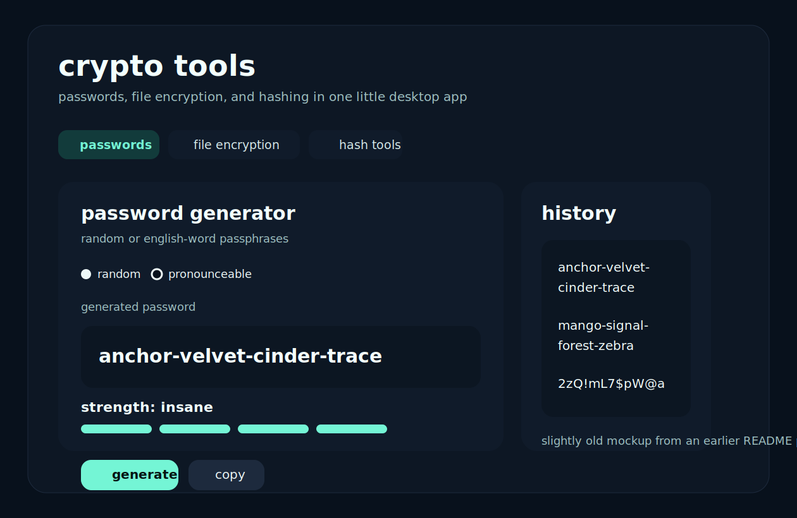

# crypto tools

I wanted to make something a little bigger than another tiny "generate a password" script.
it started there, then it turned into file encryption, hashing, and a desktop gui.



## what it does

- generates random passwords with configurable character sets
- generates english-word passphrases
- keeps a password history in the gui
- encrypts and decrypts files with aes-256-gcm
- hashes text or files with md5 or sha-256
- runs as either a cli tool or a desktop app

## project layout

```text
crypto_tools/
|-- __main__.py
|-- cli.py
|-- files.py
|-- gui.py
|-- hashing.py
|-- passwords.py
`-- preferences.py
tests/
|-- test_files.py
|-- test_hashing.py
|-- test_passwords.py
`-- test_paths.py
docs/
|-- gui-screenshot.svg
`-- issue-log.md
CHANGELOG.md
pyproject.toml
README.md
```

## install

```powershell
python -m venv .venv
.\.venv\Scripts\Activate.ps1
python -m pip install -e .
```

main deps:

- [`cryptography`](https://cryptography.io/) for aes-gcm encryption
- [`tkinterdnd2`](https://pypi.org/project/tkinterdnd2/) for drag-and-drop in the gui
- [`wordfreq`](https://pypi.org/project/wordfreq/) for the passphrase word list

## run it

desktop gui:

```powershell
python -m crypto_tools gui
```

or without the attached console window on windows:

```powershell
.\.venv\Scripts\pythonw.exe -m crypto_tools gui
```

password cli:

```powershell
python -m crypto_tools password --length 24 --symbols --show-strength
python -m crypto_tools password --mode pronounceable --words 5 --count 3 --show-strength
```

file encryption:

```powershell
python -m crypto_tools encrypt .\notes.txt
python -m crypto_tools decrypt .\notes.txt.enc
```

hashing:

```powershell
python -m crypto_tools hash --text "hello world" --algorithm sha256
python -m crypto_tools hash --file .\notes.txt --algorithm md5
```

by default, decrypted files go to names like `notes.decrypted.txt` so i do not accidentally stomp the original one.

## build a windows app

if i want a standalone build for demos, i use pyinstaller.

install the extra build dependency:

```powershell
python -m pip install -e .[build]
```

then build the app:

```powershell
.\scripts\build_windows.ps1
```

that drops the packaged app here:

```text
dist\CryptoTools\CryptoTools.exe
```

if i want to rebuild from scratch:

```powershell
.\scripts\build_windows.ps1 -Clean
```

for a showcase on another windows pc, the easiest move is usually to zip the whole `dist\CryptoTools` folder and bring that over.

do not commit the `dist` folder to git. if i want to share the built app, i upload the zip in a GitHub Release instead.

## a few notes

- random passwords use python's `secrets` module
- passphrases are built from filtered english words and still picked with `secrets`
- file encryption uses aes-256-gcm plus pbkdf2-hmac-sha256
- if decryption fails, it is usually the wrong password or a modified file
- passing a password with `--password` is handy for testing

## rough edges

- `600000` pbkdf2 iterations can feel a little slow on older machines
- the passphrase list is better than the old hand-written one, but some words are still pretty plain
- md5 is here mostly because it is familiar and useful for quick checks, not because it is modern crypto

## what changed

see [CHANGELOG.md](CHANGELOG.md) and [docs/issue-log.md](docs/issue-log.md).

## tests

```powershell
python -m unittest discover -s tests -v
```
